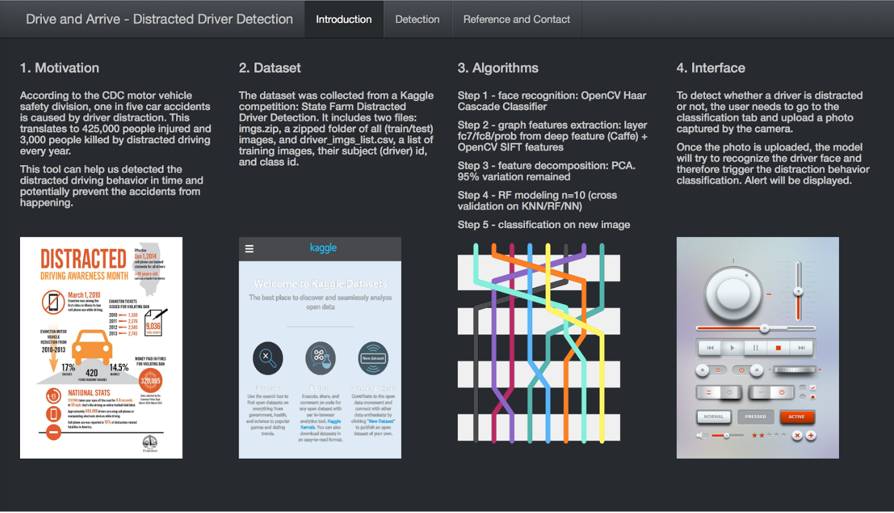
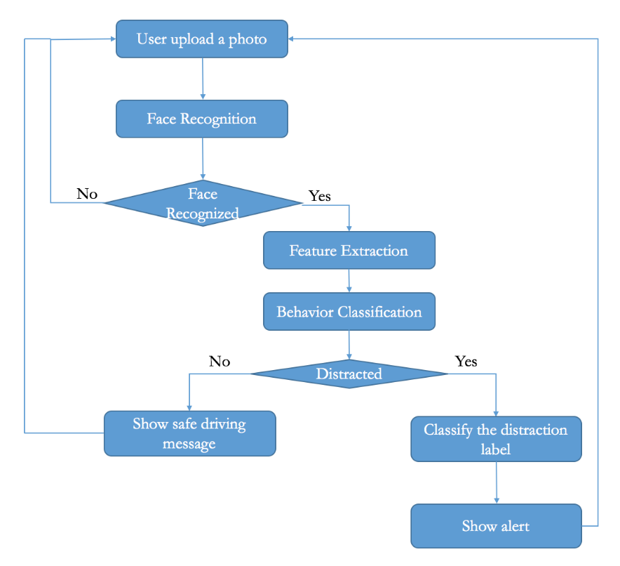
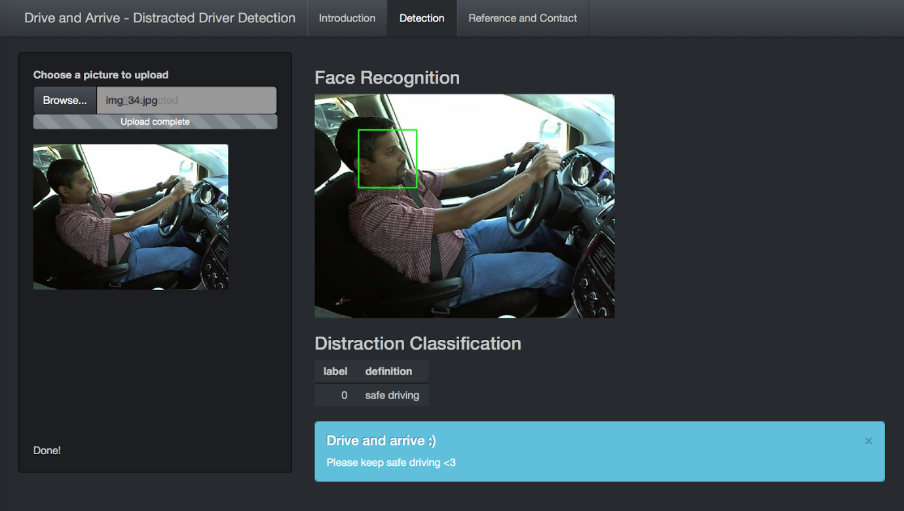
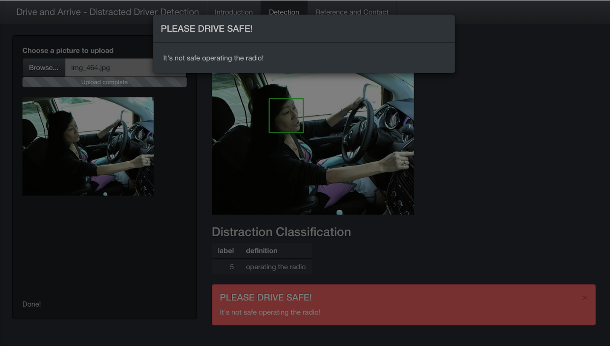

# Drive and Arrive - Distracted Driver Detection



+ Background: According to authorities, 1/5 car accidents are caused by distracted driving, causing 425,000 people injured and 3,000 people killed every year. Therefore, this project is aimed to enable dashboard cameras to automatically detect drivers engaging in distracted behaviors to avoid traffic accidents. Such kind of effort can not only protect driver's personal and property safety, but also bring benefits to insurance companies and governments.

+ Data description: The dataset was collected from a Kaggle competition: State Farm Distracted Driver Detection. It includes two files: imgs.zip, a zipped folder of all (train/test) images, and driver_imgs_list.csv, a list of training images, their subject (driver) id, and class id.

+ Team 201612-42 members
	+ team member 1: Yaqing Xie (yx2316)
	+ team member 2: Yuhang Liu (yl3380)
	+ team member 3: Jiaming Liu (jl4564)

## System Design and Methodology:  
Drive and Arrive aims to detect driver distractions and give prompt alerts to correct people’s inappropriate driving behaviors. To guarantee the performance as well as the efficiency of the system, the following  methodologies are adopted:  

   <br />

+ 1. Face recognition  
Assume the camera captures the driver as frequently as once per second, the system will have to process a decent amount of photos and classify each of them to a specific behavior label. To avoid this computationally expensive situation,  the distraction detection algorithm will be triggered only after the face of the driver is recognized.
+ 2. Image Feature Extraction  
To study driver’s behaviors, deep features of the photos are needed. Different frameworks and libraries are applied.
+ 3. Feature Decomposition  
The deep features of the images are of very high dimensions, which might impede the classification modeling process. Therefore, Principal Component Analysis is incorporated to balance the tradeoff between the time and accuracy of classification. 
+ 4. Classification/Distraction Detection  
Since multi-label classification is involved, the candidate models chosen for this project are: Neural Network, K-Nearest Neighbors and Random Forest. We applied cross validation for model selection and fine-tuning to decide on model parameters.
+ 5. Interface Construction  
The interface allows user to provide photos for detection. Face recognition, feature extraction and distraction detection will be implemented. Customized alert will be displayed to rectify distracted driving.

## Tools and Dependencies
+ 1. Spark + Python  
The face recognition and feature extraction are implemented in Python because of the library dependency. Packages including Caffe and OpenCV are required for the system to function. 
To improve the efficiency of the system, Spark is applied to enable fast large-scale data processing. Specifically, command spark-submit is called to run the python scripts.
Model training/classification is developed in Python with Spark as well considering the unity of the system.
+ 2. R Shiny  
The final web interface is implemented in R with Shiny. The server will call Spark and run the python scripts automatically once the photo captured is ready.

## Code and Report
For the detail of face recognition, feature extraction, model training etc., please refer to the code and the final report.  
All the code can be found in the [lib folder] (./lib).  
The report, presentation and video introduction can be found in the [report folder] (./report).  

## Interface and Illustration:
Once a photo captured by the camera is available, the app server will read the photo and then triggers Spark to run scripts of face recognition, feature extraction and behavior classification/distraction detection.  

   <br />
  
In the example above, the system classifeid the driver as safe driving and therefore showed an encouraging message in blue.  
If the driver is distracted, the system will look into his/her behavior and then display both a pop-up window and a red alert banner to correct the driver's manner. 

   <br />

## Repository Structure
```
proj/
├── data/ (raw data from Kaggle.com and the photo features extracted by our scripts)
├── figs/ (figures necessary for the ReadMe file or the R shiny app)
├── lib/ (all the code involved in this project)
├── output/ (processed data for the app)
├── raw_images/ (indicates where to download all the training photos)
├── report/ (final report, presentation and video)
└── test_images/ (some images used for app illustration)
```

